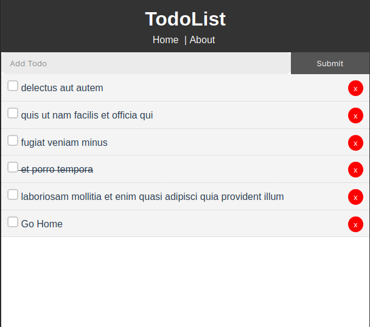

# vue-todo-app
I'm the react guy. But [@GabrielFemi](https://github.com/gabrielfemi) won't let me be. So here I am, giving it a try. I don't see myself falling in love with it any time soon.
But I would be able to collaborate with Gabriel and other **vue** friends or developers.

It' s a simle todo app, consuming the [JsonPlaceHolder](jsonplaceholder.typicode.com) todos API.

## Project setup
```
yarn install
```

### Compiles and hot-reloads for development
```
yarn serve
```

### Compiles and minifies for production
```
yarn build
```

### A Screenshot

